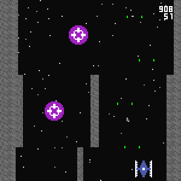

# Демонстрационный проект wamicro-38

Это **wamicro-38** — исследовательский проект. Цель: изучить, можно ли использовать WebAssembly для создания суперкомпактных проектов в духе демосцены.

Формальный критерий успеха: упаковать небольшой проект в data-url и не выйти за 4096 байт (предельный размер сообщения в Telegram).

Когда-то давно автор делал похожий проект на чистом JS, он выступает в качестве конкурента и эталона: [distance-21](https://github.com/ein-gast/distance-21)

## Как собрать

Основной код проекта написан на Си, обёртка на JavaScript. 

Для сборки потребуются `clang-20`, `wasm-ld-20` и утилита `wasm-opt` из [binaryen](https://github.com/WebAssembly/binaryen), а так же `node>=v19`. Версии `clang` можно поменять в файле **build.env**.

Ещё нужны утилиты `sed`, `head`, `tail`, `gzip`, `base64`.

По шагам:
```
npm install -ci
./build.sh
```

Итог сбоки только **build/app_Z.html** и **build/app_Z.url2.md**, остальное нужно только при разработке.

## Лиценизия

Весь исходный код, написанный автором, выкладывается под лицензией MIT. Однако [одна утилита](./3d-party/small-wasm-trimmer.c), используемая для дополнительной оптимизации, [взята из репозитория](https://github.com/NathanARoss/small-wasm-trimmer), автор которого не указал явно лицензию (но всё равно спасибо ему).

## Итоговая игра

**Управление.** Клик любой кнопкой мыши или нажатие на любую клавишк клавиатуры меняет направление полёта. Выстрелы происходят без участия игрока.

**Счёт очков.** За пролёт экрана +1 очко, за попадание в мишень +50 очков.

**Цель.** Нужно набрать как можно больше очков до того как расшибёшься. О стены можно разбиться, о мишени — нет.



## Итоговое сравнение

Игра упакована в сообщение менее 4096 байт. В сравнении с **distance-21** объём итоговой сборки больше. В сравнении с **distance-21** не используется динамический свет, что сильно обеднило визуал. В сравнении с **distance-21** удалось использовать растры.

С точки зрения суперкомпактности связка Си+WebAssemby не даёт прямых и явных преимуществ, но как вариант имеет право на жизнь.

## Готовая сборка

Ниже приведён собранный проект v1.0. Скопируйте data-url и вставьте в адресную строку браузера. К сожалению, у большинства мобильных браузеров нет поля для ввода URL, а только комплексное поле «поиск или URL», поэтому этот способ — только для десктопа.

```text
data:text/html,<script>U=Uint8Array;new Blob([U.from(atob("H4sIAAAAAAAAA21XXYwbVxW+986M7d2xswMEqWILjE0e7OIM27QkIluH3KT521RVVYknHtbe9eyuZ/yTeL35IVp5kYLET1JFKFl+VIkAURUJpKLCQ1GRuiQRakWF8hCJSOQhSAHRByqeEA+VwnfOnXHcKN71zL3n3nvOuefnO8eisdqRQgj53ERdDYdyWBeiLoeiLuQ6EUTdGjLZxgszZ2jeRBWWNyWkEsKynYySUmVzjiWFnfmsNZT60odT7lDoSzl+YpLdmc10wk6vf1YJeUxMyONiUr4iXPmqyKto1ZLu/PxK2Dgxv9BYDS2Vl2ry/uenDgpfaC8uCl9q/s5NaxkVpbUfExmX5CF7vxZTLu2KsEuUlSgImuYjLXYrUNx3pbSHXxLax/YdxMSOSsJT2CM9y5dlldOqExV5uL2o9J2Lrr5keaIo1H419BWE2vt9QV8tiSX25SEOK17s2UVw8q3dKoeX2q1sd8SgJA4VFOQ9FeUlVDpUkJjkIzfhA1WJC7h5T2aE3X60Q7gXYNwhDpn76O16U3o2NhAf/QUa5vSQTuv/CX0FayWwz0N5GIkskotxwZLUMy8VhOe88+ISf/759eahAvjxDj3j41y0W3k0zZtpXFSsuB6C7hqttrt/ldIZsqFhq617LgYlSz/dLtn6X/fcqOTgwFMRqKStrW8TLeOLihJ7mHAXBGzJRSPKfUPxUopDVoCZYXFL32IJR3j8mUhv75Eooe/gTJnNcduMoqJy/QypKFxSK1EN0YIzJVImYeWLw4gZjMl80RZW6Yiv3E8JMlf8ludc9sVbP/xYuFUph/rCFP6J079f/8lrdlv//r6I9MOH1omS8cdvD4qHwyNX3BY2k5PoOzddFJaJGblTCK0GeuPvsANFg4xA2StgTUyUmUieWGaieGKbCaJSOwh4UhZpAH+47pvkAf3jG4npETQs0WKrFikscnHRwWUU+V3EHFjImoy+esMlxRAYlj2EtciLJUmP7NECK1FGWGWjuYLEHoeT4yiCxOaYn0tH3lHENa9unysoMqRNLnD00OVUzFEqWqSwlReucJeRSVDmipzDbfDsk259LY72wdHaKSwTiAqB3YaiMBcylBbYTuQmmkia4K3YGhacIM2yQhJh5LofWUoN1brekQDEtV1wtdqPd0J48PxhTsLfXHQTeJCEG5K1dJ60AHsT0ecA2rroHvjzxsaGhyjVb2Oy+e2NjauSZu9h9hCfKZr87iIDUofO3AYY0DX0/QIF0YOCl9HX8zT8dR7D80z9LlH/s/WtNGo8h735y784j27Jqn3/8vUzBgV+gTXfOoilA5fxvPpHBKx+IKJSsv3ntJ6Mr46N7YiiyIFVNqURB1zyHEi0D4o/vXmYmAlBzNQAmDGmgjQysU28xzLfu0HbdsQlZZZZZDK+OhongUsWdl0Dw2KH0aQkGYY3pQGzTUarfEwoBKj3rM/pTxvHwSKSAd94BHsZGJ9HXJGBKcXkkQJ7gQsAGQsDb8LVt8j+9MQ8pkz/b066Q/36DZf9TGnEgydyAtCIl8yM78HgAsfTt2wcTdDzCFyQjgkkqsOkerpxE6rbScqy1XGZk1y9gH+UK0+3Gch8OV3iHOSkdKI5A1VGla0UCkfolYDXE4XnLUJiawDqtRsIHS5dFkEApCQ398fxkWQ+lcwtn1kodlpyCd+ZIz+4I0sVxKPr9agQfwDLfHAxgV1SjGoQ/SX2B3WbhfIPjY3lWEQyRrBtGXPiqq9JQBDNOfHg82RttBdBpAmaRntc/YeL/CVNWXp6xNB0zstq8bLNymsKaPKqvjaRxEpHywGz2fiQt2+pdOEEpNx519XbTUWn0H1fmiQEa9SsA/739lDd/yCNmcvs5+OQdflGqt3rxvcWdQdFRHeCw2iOLKpHn4AolSBRiXuE9yWjGNdpnDcmL2ZTE+a0XUQ647BDHZFDbQYc7eeiEjcTlp/l/oWjPG+5iou3XZxIVCqhweEmZxoRunXTLSpWzEaBULScoX5AwB1+hgJzIi5N+pNtvSWOGxIkxCjwmba2iaIe1QL4FlMUA4UgpwRgECB5R02PxlGHAwN9n8DtASfkWBDtiozzWWHErp24MDmK0BzHb84ZbYxFrQ/0hixF+0ktF8zyeH/HgpqkGnd+SQC/IeOXC5LYMWPIQuIofesmdSZGy62baeLAblTdIriuRzYWqRqcTqZIUxiloWRy4W+OzAzZtFTnDo8SO/H7KHMLijvdESAgExkT0mRDxVUprhiYUDF6r00UV4YNO0bGY3YSnrdPJkWWRPaovBYdSMMCbot42cQlHrwpexRAuNIVeRx7HWpXLk1RvyAoGIy+1BGQ7qOeQI16ApX0BEkDgZ5AcrcIORkvh66Mig5aMzKOMq4i8yXNwRjsJI6EWJlmrer4KmY96QJ30X9RZSlabDM2Y8qX4I4dvYGITBBq2qOxzc09/26Aa7gQ6Y2Xye4UJodMcqVo8fY4aMQJH3uYFgRJBQE/b4ghzPQxSn72ZIzMc/U7ea8AnFo3DjWtP/I/GuUw6UeoGxmszpDbUj9SUEUsEXmr9PmcRz8DsCkiLE7nNl02HltPlh7LA4KrKE0Glno3IYzE3TOEGMP7ydqPCtB/rO+BTZwEyrxtmKRp6W3T5xHc58eD+7pEcJNyUHlXlx5Hp0sZTqK4mCW3xMUcQ5RH9WsKkJBFB5lpR8AhoCJu5ugp34nxyh2b1hNYmPRzbEpLe3QNhxzopG6e8Cfp9ljE9misx4ZdAEuUjGSqokpDLXG8+wNuni9ITgSlJ3vaauuPCibabYvqsXOEIQNhkyXdWAUCaQTyFymQbeJoG00sH31OliL9MSU+KRba29STKz0xR1K7RVUgbX6ahQk3cu4b9pnJyYeC/pJPOxz4jVqzt7jWCbuD6kKtEZzutwZhuf7CYqN7qrHqt5q1xX0vfMXM9tUr1cVqs/bsV2eqYa35TPOZ56tLtVZ3dRCEZ070+oPV6nJtprpSKy/WysRsORwcaofE+8DZY81yfbFeXQrMD/Rgud87Xd5TqVRo18FedxCeGZTru5p1QznWaSyHLzYGjfJMdabarC4Ep1vNwUptIVgJW8srg1qzUm3VloKxH/TBqUZ7LaxGtW542v9GGXJqI2kLa0tLYb8SrK4tNPr9xtlyq9r6clipxrVObd+51lJ5uXKuH55cC1cHutvqNAatXvdwv9EJy3Flth8O1vrd9aXg1XKrMrsSNKFWsBoOylFldjE4sTam7AqUnaETT2a1Xm3X6p1Wt/y1mVOnq3isVOqzC8Hq4Gw7rNX5hnt3nGuvz5pLmnGLuO/sh91m2G91l/eeaJ0J241B2KzPLgXHys89V5mFMsdgwT4sUO7iQsu1Z7H2SrkyC4esV2lLI+h1O7211bDZO92t0SwOz/K4V9u3FBzH3rgM1QuTAr8d3H8oCwHiH//mrx4G9JtDU7zo5CN0wG8kbBCkA5/eKcVPKH5KMQOfPoEQxHv+Z8Wtx3nPz88L8+IBvwNh3ukgCALBb6Ikg3nBdIyEUGD2iC2IOkg/j0bJRwR0k+Q/YEX5PmacLj92UqezdJlPfJIHPVh2enA0GI1IO/l/YlMVhB0TAAA="),c=>c.charCodeAt(0))]).stream().pipeThrough(new DecompressionStream("gzip")).getReader().read().then(({value:Z})=>{WebAssembly.instantiate(Z).then(({instance:inst})=>{let i=inst.exports.js.value,S="",m=new U(inst.exports.memory.buffer);for(;m[i]!==0;i++){S+=String.fromCharCode(m[i])}eval(S)})});</script>
```
